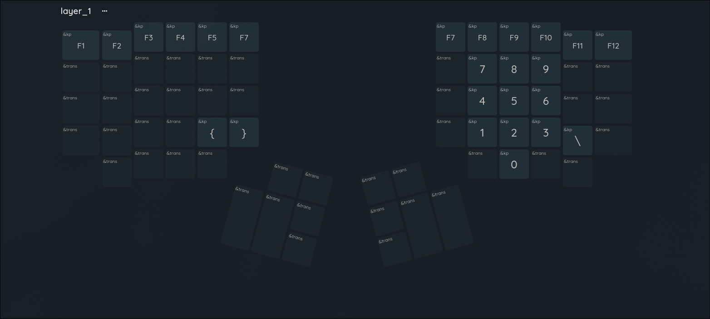
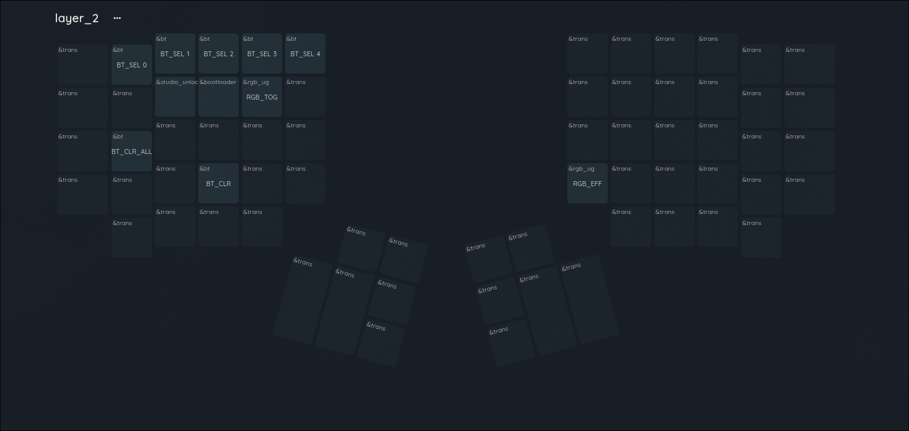
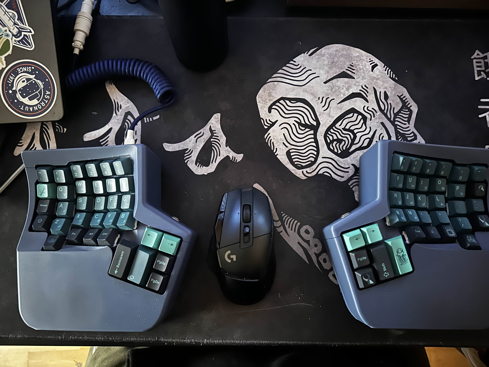

# WK Kinesis ZMK Configuration
A ZMK firmware configuration for a custom split ergonomic keyboard based on the Kinesis layout.

## Overview

This project contains the complete ZMK (Zephyr Keyboard Firmware) configuration for a split ergonomic keyboard with the following features:

- **Split design** with left and right halves
- **Kinesis-inspired layout** with optimized key placement
- **Bluetooth connectivity** with support for multiple devices
- **RGB underglow** support (configurable)
- **Battery monitoring** with configurable reporting intervals
- **Multi-layer keymaps** for enhanced productivity

zmk config based on the [zmk-config-wk360](https://github.com/weekinro/zmk-config-wk360/tree/master)

## Hardware

- **Microcontroller**: Nice!Nano v2
- **Layout**: 5x16 matrix with Kinesis-style ergonomic arrangement
- **Connectivity**: Bluetooth (with USB support)
- **Power**: Battery powered with monitoring

## Keymap Layout

### Base Layer
Standard QWERTY layout with homerow mods and ergonomic key placement:


### Layer 1 - Function & Numbers
Function keys and numpad layer:



### Layer 2 - System & Bluetooth
System controls and Bluetooth device management:


### Keyboard IRL


### Homerow Mods
The keyboard implements homerow mods using hold-tap behavior:
- **A**: Left GUI when held, A when tapped
- **S**: Left Alt when held, S when tapped  
- **D**: Left Shift when held, D when tapped
- **F**: Left Ctrl when held, F when tapped
- **J**: Right Ctrl when held, J when tapped
- **K**: Right Shift when held, K when tapped
-keyboard **L**: Right Alt when held, L when tapped
- **;**: Right GUI when held, ; when tapped

### Bluetooth Management
- Support for up to 5 Bluetooth profiles
- Quick device switching via Layer 2
- Clear all paired devices functionality

### Power Management
- Configurable sleep timeout (default: 15 minutes)
- Battery reporting every 60 seconds
- Enhanced power efficiency with XTAL clock source

## Building

To build this firmware:

```bash
# Build for left half
west build -b nice_nano_v2 -- -DSHIELD=wk_kinesis_left -DZMK_CONFIG="config/wk_kinesis.conf"

# Build for right half  
west build -b nice_nano_v2 -- -DSHIELD=wk_kinesis_right -DZMK_CONFIG="config/wk_kinesis.conf"
```
If using nix:
```bash
nix build .#firmware
```

## Flashing

After building, flash the firmware:

```bash
# Flash left half
west flash --dfu-util

# Flash right half
west flash --dfu-util
```
If using nix:
```bash
nix run .#flash
```

## Configuration

Key configuration files:
- `config/wk_kinesis.keymap` - Main keymap definition
- `config/boards/shields/wk_kinesis/wk_kinesis.conf` - Hardware configuration
- `config/boards/shields/wk_kinesis/wk_kinesis.dtsi` - Device tree definitions

## Customization

### RGB Underglow
To enable RGB underglow, uncomment in `wk_kinesis.conf`:
```
CONFIG_ZMK_RGB_UNDERGLOW=y
CONFIG_WS2812_STRIP=y
```

### Sleep Settings
Adjust sleep timeout in `wk_kinesis.conf`:
```
CONFIG_ZMK_IDLE_SLEEP_TIMEOUT=900000  # 15 minutes in milliseconds
```

## Project Structure

```
├── config/
│   ├── boards/shields/wk_kinesis/
│   │   ├── wk_kinesis.conf          # Main configuration
│   │   ├── wk_kinesis.dtsi          # Device tree
│   │   ├── wk_kinesis.keymap        # Keymap
│   │   └── boards/nice_nano_v2.overlay
│   └── wk_kinesis.keymap            # Root keymap
├── assets/                          # Documentation images
├── build.yaml                       # Build configuration
└── README.md                        # This file
```
